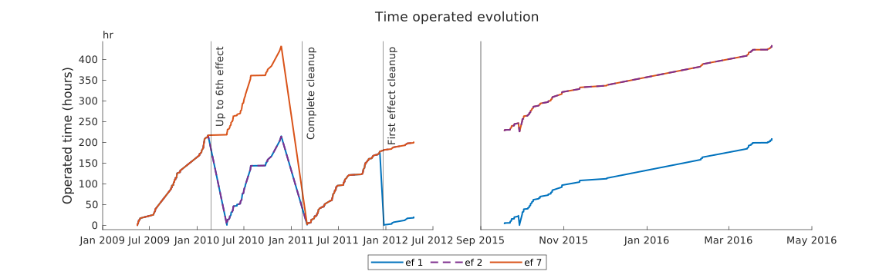

## Detección de operación en estado estacionario

Ventana temporal móvil donde se comprueba que la desviación máxima respecto al valor medio esté dentro de un margen permitido para cada una de las variables de interés. Si todas están dentro de los márgenes permitidos por el tiempo establecido se considera operación en estacionario.

Variables consideradas:
- $T_{s,in}$  $[\degree C]$ Hot water inlet temperature
- $T_{s,out}$  $[\degree C]$ Hot water outlet temperature
- $M_{s}$  $[m^3/h]$ Hot water flow rate
- $T_{cw,in}$  $[\degree C]$ Cooling water temperature at inlet of condenser
- $T_{cw,out}$  $[\degree C]$ Cooling water temperature at outlet of condenser
- $T_f$  $[\degree C]$ Feed water temperature at first effect (preheated seawater)
- $M_f$  $[m^3/h]$ Feed water flow rate
- $M_{cw} \:/ M_{sw}$  $[m^3/h]$ Cooling water flow rate
- $T_{v,c}$  $[\degree C]$ Vapor temperature in condenser
- $M_{prod}$  $[m^3/h]$ Distillate production flow rate

## 2. Filtrado
Tras el procesado de todos los datos históricos disponibles (2009 - 2016) se filtran puntos de operación "similares".

**NOTA:** $\Delta X \rightarrow |X_{i}- X_{i+1}|$

Al menos una de las siguientes condiciones se debe cumplir para que un punto de operación se considere único:
- $\Delta T_{s,in} > 0.5 \: [\degree C]$
- $\Delta T_{s,out} > 0.5 \: [\degree C]$
- $\Delta P_{v,c} > 1.5 \: [mbar]$
- $\Delta M_{s} > 0.2 \: [L/s]$
- $\Delta M_{f} > 0.2 \: [L/s]$
- $\Delta T_{cw,out} > 0.5 \: [\degree C]$
- $\Delta T_{s,in} > 0.5 \: [\degree C]$
- $\Delta t_{operated} > 10 \: [hours]$
- $\Delta t_{elapsed} > 120 \: [hours]$

**Resultado**

