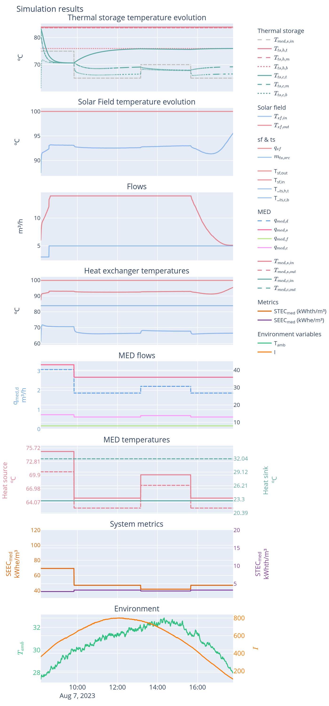

## Caída repentina de temperatura en tanque caliente

> Hola Juanmi,
>
>Te pasamos un reporte de una situación que no entendemos la razón por la que ocurre.
>
>Estamos analizando algunos de los agentes y entender poque no son capaces de operar durante más tiempo. Parece ser que normalmente es debido a que se quedan sin energía con facilidad. Concretamente vemos caídas repentinas de la temperatura superior del tanque caliente.
>
>Te pasamos un reporte que nos gustaría que lo vieras antes de la reunión y que tengas una idea de lo que pudiera estar pasando. A modo de resumen, en el step 27 del episodio se puede ver que en el hay una caída de temperatura que no entendemos la razón por la que ocurre o si es normal. A simple vista no se ve un cambio significativo de las variables de un step y otro.
>
>

> [!info] Material auxiliar
> Archivo con informe del ensayo: [report_caida_Tts.html](../issues/report_caida_Tts.html)

Esto tiene pinta de ser problema del solver, pero sería necesario ver las otras temperaturas del tanque para entender qué pasa mejor, y ver si ha habido algún cambio repentino en alguno de los caudales. ¿Quizás restringir el cambio de temperatura en los tanques entre una iteración y la siguiente?

## Temperatura de salida de la MED mayor que la de la entrada ($T_{med,s,out} > T_{med,s,in}$)

> Buenas Juanmi, estoy mirando los datos. Y sino interpreto mal los nombres de las variables, ¿Es normal que el agua caliente al salir de la MED tenga una mayor temperatura que cuando entro?

> No es normal, puede que ocurra temporalmente si por lo que sea el caudal de alimentación (Mf) se vuelve 0, pero en ese caso igualmente saldría a la misma temperatura

> Vale gracias. Reviso las variables y si eso te comento, me interesa entenderlo para el tema de extender los datos para el entrenamiento

Esto no sé si es fallo del modelo o fue una pregunta general, si es fallo del modelo necesitaría los datos del estado cuando pasa. 

¿Si $q_f$ es cero, qué pasa con la temperatura de salida, la hago igual que a la entrada? (duda interna)

Respuesta: 
	sí, si med no está activa: `self.Tmed_s_out = Tmed_s_in`


## Temperatura de los tanques por encima del máximo

Valor actual de $Tts,max$, no hay, ¿cómo gestionar esto? Devolviendo una penalización por haber superado el valor máximo de temperatura, que no debería superar los 110 ºC o algo así? Sería interesante incluir un atributo en la clase que indicara el motivo por el cual se ha incluido una penalización

> Buenas estamos evaluando algunos de los entrenamientos de prueba y nos hemos encontrado, en una situación en el que el tanque pasa a una temperatura de 300 ºC. ¿Eso podría ser normal?

```
{
	"t_amb": [24.14849281311035], 
	"wmed_f": [35.5], 
	"tmed_c_in": [21.962806701660156], 
	"tmed_s_out": [56.096893310546875], 
	"mmed_c": [20.596384048461914], 
	"mts_dis": [0.0], 
	"mts_src": [7.797454357147217], 
	"tts_t_in": [63.16987991333008], 
	"remaining_steps": [47.0],
	"tts_h": [100.0, 100.0, 83.98274230957031], 
	"tts_c": [100.0, 100.0, 82.1102066040039]
}
```


## Evolución temperatura tanques

En los resultados preliminares que saqué para el DC de 2023, sólo evoluciona la temperatura del tanque frío pero no del caliente

