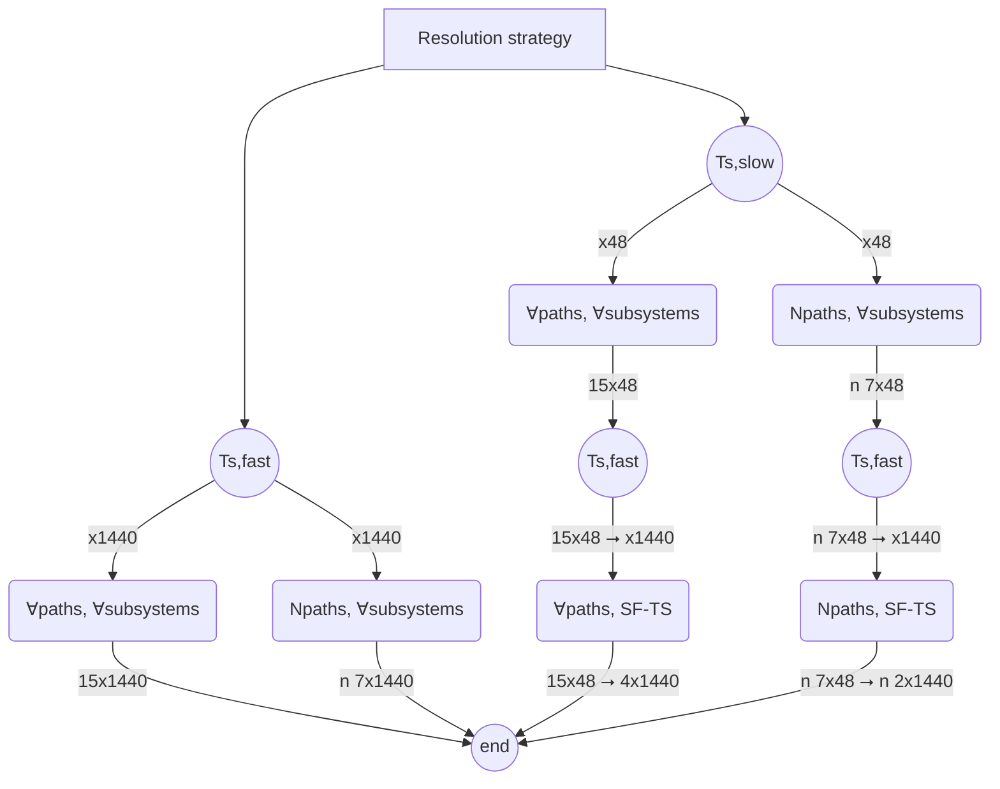

# Problem definition and characterization


%% Diagrama para visualizar árbol, no hacer como un árbol realmente %%


**WIP visualización de evolución de modos de operación**


Update:


# Problem resolution alternatives


## Two sample rates

Using this strategy has one main advantage and one main drawback. As drawback it requires solving two optimization problems, the first one with the slower sample rate, and a second one with the faster one and considering only solar field and thermal storage. Compared to just one evaluation for the single (fast) sample rate alternative. 

However, the first evaluation needs to provide a much reduced solution space (less number of steps), and so does the second one (this time with less decision variables), while also being initialized with the solution of the previous evaluation, facilitating significantly the resolution of the second more complex problem. 

All in all, this strategy reduces significantly the complexity of the problem.

$n_{vars, all} \times t_{s,slow} \rightarrow n_{vars, SF-TS} \times t_{s,fast}$

## Complete problem or a number of predefined paths problems

One of the most important considerations when attempting to solve the optimization problem, is whether the paths to take (operating modes evolution in the prediction horizon) are pre-computed or if on the other hand, it's left to the optimization algorithm to explore the tree and generate its own trajectories.


### One complete problem

In this scenario, the optimization 

### N predefined path problems

Here the path or trajectory to follow is pre-defined, in order to avoid the tree explosion (exponential growth of options), a number of total options / branches / trajectories / paths is first defined. The idea is that starting from the complete tree of options, filter out branches applying different criteria and an iterative process until the set number of options is reached. Then each problem needs to be solved separately.

**Methodology**

1. Build the complete tree (by considering each possible transition, as defined by the FSM, at each step)
2. Apply [initial non-iterative filtering](#Initial%20non-iterative%20filtering)
3. Apply [iterative filtering](#Iterative%20filtering) until a set number of paths is reached. <- Does it really need to be iterative? Or could just the X most promising be selected directly?


#### Filtering options

A bibliography research should be carried out, but for now, just laying out some ideas:

##### Initial non-iterative filtering

- The most important variable (important as in being the one than most determines the operation possibilities of the system) for this process is the solar irradiation. Periods where it does not vary significantly or has low values, the state changes could be restricted.
- If only one sample rate is considered (the faster one), then the MED state could be restricted to change in periods not multiple of its sample rate.

##### Iterative filtering

After the initial non-iterative filtering, a decision tree with some groups is obtained.

```pseudocode
# Some kind of recursion function
def build_tree():

	def add_states():
		for valid_state in new_states:
			new_states = add_states()
			return new_states

	n_paths = 0
	for step_idx in prediction_horizon]):
		new_states = FSM[step_idx].get_valid_transitions()
	
	
while n_paths >= max_n_trajectories:

	# Apply filtering methodology
	
```

- As a first step, the tree could be evaluated up to some point (half the three for example). A cost can then be obtained for the path, and based on this information, make a selection of the most promising paths. From there solve the reduced number of paths up to the prediction horizon, and once again, selected only the most promising.

- Another option would be to solve a reduced simplified tree, where the operating modes can only change at reduced rates (e.g. if the sample rate is one hour in a 24 h prediction horizon - 24 potential operating mode changes, the operating modes can only change every 4 h - 6 operating mode changes). Solved this decision tree, the operating modes are fixed for those solved points and a new iteration is performed where the gaps between them are then solved, an so on.

## Summary

Depending on the considerations mentioned above, different computational and problems structures are obtained. In particular, the number of decision variables to solve for:

|          Problem type / Subsystems considered | SF-TS | SF-TS + MED |
| --------------------------------------------: | :---: | :---------: |
|          Complete (includes binary variables) |   4   |     15      |
| N predefined paths (without binary variables) |   2   |      7      |

On the other hand, depending on the sample rate consideration, the number of steps:

|              | Sample rate (seg) | N of steps |
| :----------: | :---------------: | :--------: |
| $t_{s,fast}$ |        60         |    1440    |
| $t_{s,slow}$ |      30 · 60      |     48     |

The optimization algorithm will need to provide a matrix solution , and there will be as many degrees of freedom as elements in this matrix that the algorithm will need to solve for:

|                                                        Resolution strategy | Resulting problem<br>structure |
| -------------------------------------------------------------------------: | :----------------------------- |
|                                          complete SF-TS+MED ($t_{s,fast}$) | 15 x 1440                      |
|                                      n predefined SF-TS+MED ($t_{s,fast}$) | n(7 x 1440)                    |
|         complete SF-TS+MED ($t_{s,slow}$) -> complete SF-TS ($t_{s,fast}$) | 15 x 48 -> 4 x 1440            |
|     complete SF-TS+MED ($t_{s,slow}$) -> n predefined SF-TS ($t_{s,fast}$) | 15 x 48 -> n(2 x 1440)         |
|     n predefined SF-TS+MED ($t_{s,slow}$) -> complete SF-TS ($t_{s,fast}$) | n(7 x 48) -> 4 x 1440          |
| n predefined SF-TS+MED ($t_{s,slow}$) -> n predefined SF-TS ($t_{s,fast}$) | n(7 x 48) -> n(2 x 1440)       |

Auxiliary table

|                        | $t_{s,fast}$ | $t_{s,slow}$ |
| ---------------------: | :----------: | :----------: |
|         complete SF-TS |   4 x 1440   |    4 x 48    |
|     complete SF-TS+MED |  15 x 1440   |   15 x 48    |
|     n predefined SF-TS | n(2 x 1440)  |  n(2 x 48)   |
| n predefined SF-TS+MED | n(7 x 1440)  |  n(7 x 48)   |


%% Diagrama para visualizar las distintas alternativas de resolución propuestas %%



# Other considerations

Artificially modifying the problem with unnecessary restrictions or by modifying the problem itself should be avoided as much as possible. Two examples:

- Trying to set as objective maximizing the operation time. If for example the optimization algorithm in one iteration tries values that invalidate the system midway through the evaluation and does not recover, the model automatically is going to penalize this behavior with a worse cost function value. And so eventually the most fit individuals or solutions will be the ones that prolong the operation for **as long as it makes *economical* sense** for the given horizon. 
- Restricting the state changes. The model itself will penalize constant state changes since it has associated transient non-productive states (*generating vacuum, starting-up, shutting-down*) between steady states (*off, idle, active*). This will result in a worse cost obtained at the end of the path evaluation.
