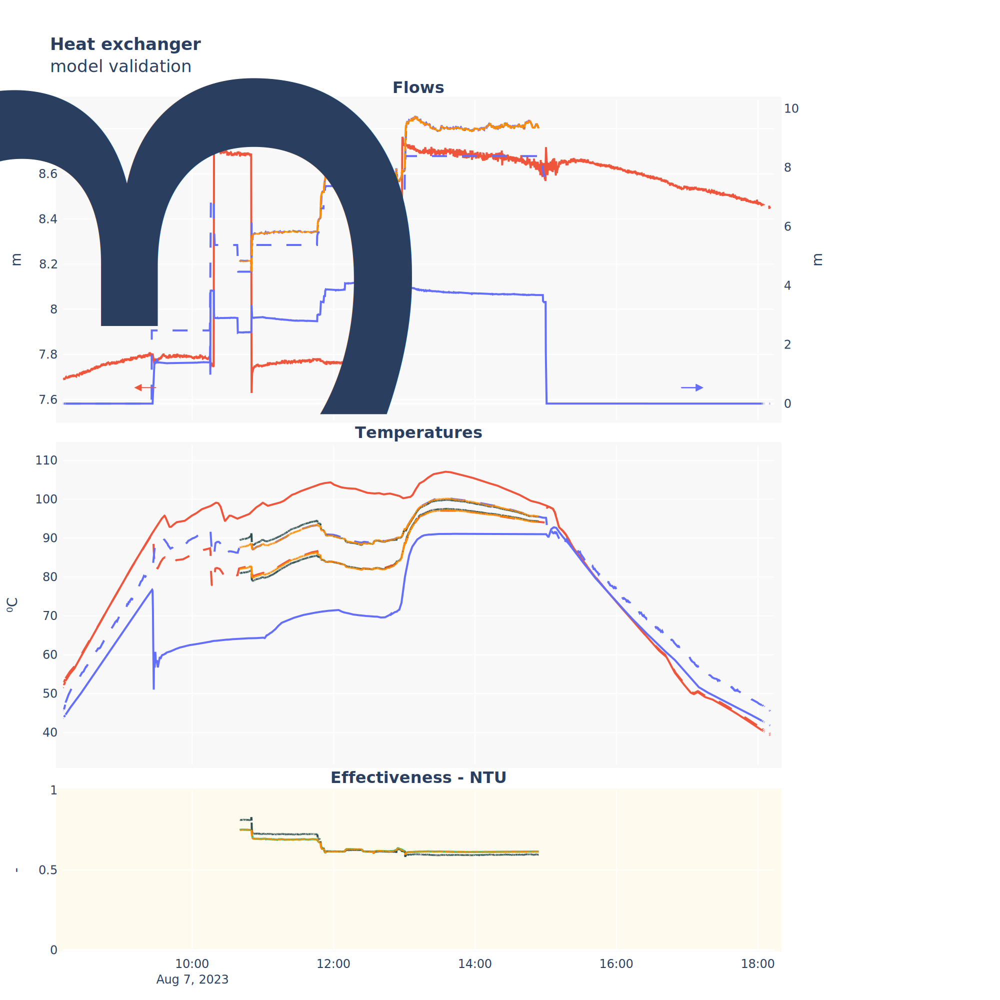

# Heat exchanger model

> [!info] 
> Puede ser que a veces aparezcan nombres de variables sin o con el prefijo del sistema ($hx$), pero son iguales.

Counter-flow heat exchanger steady state model.
Based on the effectiveness-NTU method [2] - Chapter Heat exchangers 11-5.

Limitations (from [2]): 
- It has been assumed that the rate of change for the temperature of both fluids is proportional to the temperature difference; this assumption is valid for fluids with a constant specific heat, which is a good description of fluids changing temperature over a relatively small range. However, if the specific heat changes, the LMTD approach will no longer be accurate. 
- A particular case for the LMTD are condensers and reboilers, where the latent heat associated to phase change is a special case of the hypothesis. For a condenser, the hot fluid inlet temperature is then equivalent to the hot fluid exit temperature. 
- It has also been assumed that the heat transfer coefficient (U) is constant, and not a function of temperature. If this is not the case, the LMTD approach will again be less valid 
- The LMTD is a steady-state concept, and cannot be used in dynamic analyses. In particular, if the LMTD were to be applied on a transient in which, for a brief time, the temperature difference had different signs on the two sides of the exchanger, the argument to the logarithm function would be negative, which is not allowable. 
- No phase change during heat transfer 
- Changes in kinetic energy and potential energy are neglected  

## Fuentes

[1] W. M. Kays and A. L. London, Compact heat exchangers: A summary of basic heat transfer and flow friction design data. McGraw-Hill, 1958. [Online]. Available: https://books.google.com.br/books?id=-tpSAAAAMAAJ  

 [2] Y. A. Çengel and A. J. Ghajar, Heat and mass transfer: fundamentals & applications, Fifth edition. New York, NY: McGraw Hill Education, 2015.  

## Nomenclature

  

- $p:$ Primary (hot sink / side) loop
- $s:$ Secondary (cold sink / side) loop 

 `p` references the primary circuit, usually the hot side, unless the heat exchanger is inverted. `s` references the secondary circuit, usually the cold side, unless the heat exchanger is inverted. 
 `Qdot` is the heat transfer rate `C` is the capacity ratio, defined as the ratio of the heat capacities of the two fluids, C = Cmin/Cmax  
 
 > [!info] 
 > To avoid confussion, whichever the heat exchange direction is, the hotter side will be referenced as `h` and the colder side as `c`. 

- $T_{hx,p,in}$ ($\degree$C): Primary circuit inlet temperature     
- $T_{hx,s,in}$ ($\degree$C): Secondary circuit inlet temperature
- $q_{p}$ (m$^3$/h): Primary circuit volumetric flow rate     
- $q_s$ (m$^3$/h): Secondary circuit volumetric flow rate     
- UA (W·$\degree$C$^{-1}$): Heat transfer coefficient multiplied by the exchange surface area.  

- $T_{p,out}$ ($\degree$C): Primary circuit outlet temperature
- $T_{s,out}$ ($\degree$C): Secondary circuit outlet temperature

### Inputs / outputs

$$  T_{hx,p,out},T_{hx,s,out} = f(T_{hx,p,in},T_{hx,s,in},\dot{m}_p,\dot{m}_{s}, T_{amb}, (UA)_{hx}, H)  $$
$UA$ and H are parameters to be calibrated. It depends on the heat exchange surface (if known it can just be substituted) and the heat transfer coefficient, which depends on the temperature difference between the ambient and heat exchanger.

### Equations

Calculate heat capacities:

$C_p = \dot{m}_p \cdot c_{p,Tp,in}$
$C_s = \dot{m}_s \cdot c_{p,Ts,in}$
$C_{min} = min(C_p, C_s)$
$C_{max} = max(C_p, C_s)$

Calculate the effectiveness:

$C=\frac{C_{min}}{C_{max}}$
$\epsilon = \frac{1 - e^{ (-NTU \cdot (1 - C))}}{1 - C \cdot e^{-NTU \cdot (1 - C)}}$

Calculate the heat transfer rate:

$\dot{Q}_{max} = C_{min} \cdot (T_{h,in} - T_{c,in})$

Finally calculate the outlet temperatures:

$T_{h,out} = T_{h,in} - (\dot{Q}_{max} * \epsilon) / (C_h)$
$T_{c,out} = T_{c,in} + (\dot{Q}_{max} * \epsilon) / (C_c)$

## Resultados

Se está pendiente de conseguir una medida fiable para el caudal del secundario del intercambiador de calor, por ahora, de manera temporal se puede estimar haciendo uso de las temperaturas de salida con un balance de energía:

$$q_{c}=q_{h}·\frac{c_{p,h}·(T_{h,in} - T_{h,out})}{c_{p,c}·(T_{c,out} - T_{c,in})}$$

[Versión interactiva](attachments/heat_exchanger_validation.html)

La línea continua azul de caudal es la señal proveniente del sensor, la discontinua es una estimación con una curva de ajuste que se hizo un mes tras el mantenimiento de la sonda, parece que para entonces ya se había ensuciado ligeramente, por lo que ese ajuste tampoco es válido. Finalmente la línea *dashdot* (no se ve porque está superpuesta por la línea naranja que indica que ha sido usada por el modelo)

En cuanto a salidas de modelo, hay dos comparaciones, la línea gris oscuro es el modelo completo dándole como entrada el UA calibrado, mientras que a la naranja directamente se le da la *eficiencia-NTU* estimada a partir de las temperaturas de salida.

Usando caudal bueno:

Usando caudal malo:

## Otros

# Old

## Equations

$$
\begin{equation} \tag{1}
T_{hx,p,out} = T_{hx,p,in}-\eta_{hx,p}·\frac{(\dot{m}c_p)_{min}}{\dot{m}_{p}c_{p,p}}(T_{hx,p,in}-T_{hx,s,in})
\end{equation}
$$
$$
\begin{equation} \tag{2}
\: T_{hx,s,out} = T_{hx,s,in}+\eta_{hx,s}·(T_{hx,p,in}-T_{hx,p,out})
\end{equation}
$$
$$
\begin{equation} \tag{3}
\eta_{hx,p}=\frac{1-e^{\theta}}{1-\frac{(\dot{m}c_{p})_{min}}{(\dot{m}c_{p})_{max}}e^{\theta}}
\end{equation}
$$
$$
\begin{equation} \tag{4}
\eta_{hx,s}=\frac{\dot{m}_{p}c_{p,p}}{\dot{m}_{s}c_{p,s}}
\end{equation}
$$
$$
\begin{equation} \tag{5}
\theta = UA·\left( \frac{1}{(\dot{m}c_{p})_{max}} - \frac{1}{(\dot{m}c_{p})_{min}} \right)
\end{equation}
$$
$$
P_{gen} = \dot{m}_p·c_{p,p}·(T_{hx,p,in}-T_{hx,p,out})
$$
$$
P_{abs} = \dot{m}_s·c_{p,s}·(T_{hx,s,out}-T_{hx,s,in})
$$
