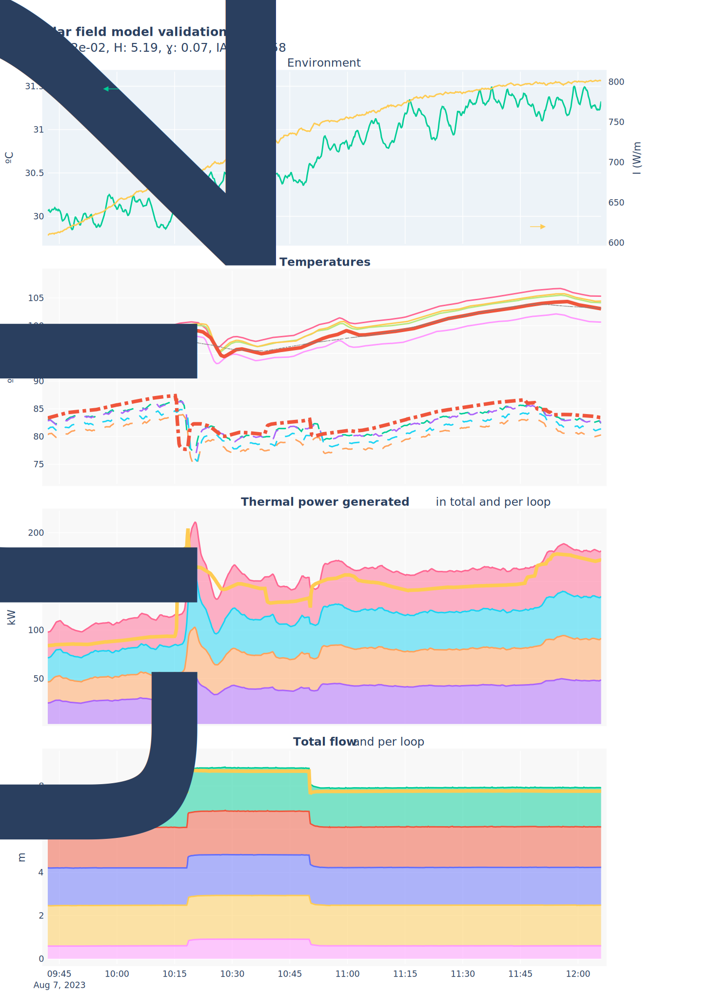
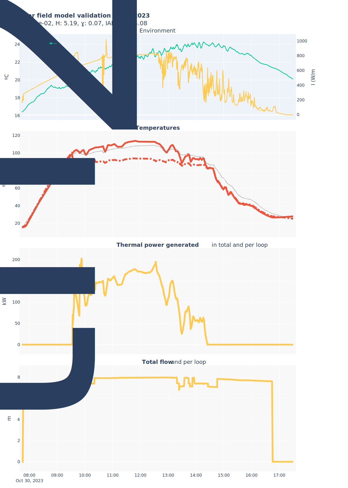
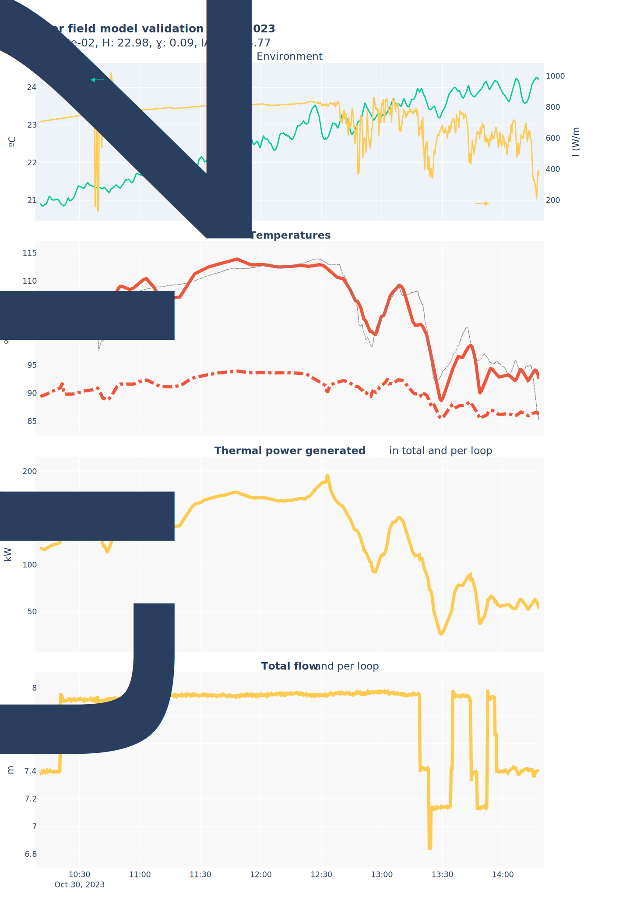
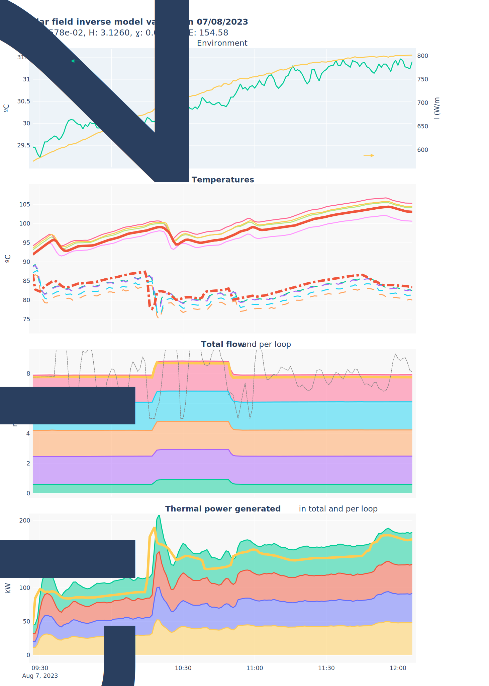
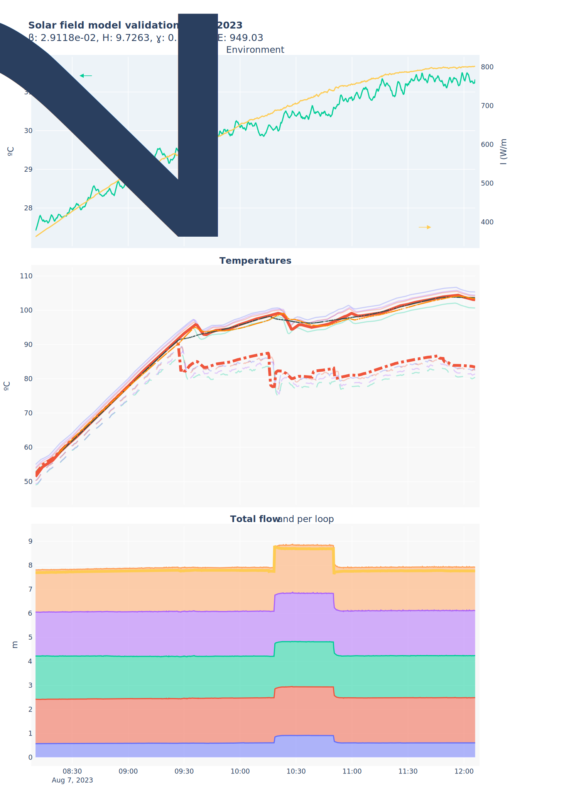
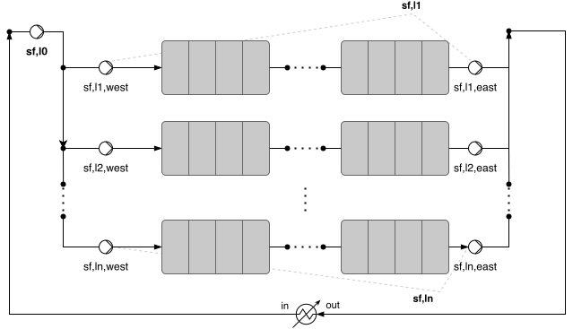

# Solar field model

> [!info] 
> Puede ser que a veces aparezcan nombres de variables sin o con el prefijo del sistema ($sf$), pero son iguales.

The solar field is basically a converter of electrical to thermal energy, the conversion factor is the SEC ($kW_{e}/kW_{th}$), if it is less than one it means that we have to give the system more electrical energy than the thermal energy we get, values above one means that there is a gain. But it is not only the exchange factor that matters but also at what temperature the heat is obtained (exergy).

The diagram shows the individual loops that make up the field, in stationary conditions and for the model it is considered that the flow rates and temperatures are equal in each of the loops (balanced flow distribution), and therefore can be simplified to a single loop with collector area the sum of the individual loops.

Two models concerning the solar field are developed, the first one predicts the outlet temperature given the other variables, while a second *inverted* model provides the flow needed to obtain a certain outlet temperature, given also the rest of inputs.

## Bibliography

[1] G. Ampuño, L. Roca, M. Berenguel, J. D. Gil, M. Pérez, and J. E. Normey-Rico, “Modeling and simulation of a solar field based on flat-plate collectors,” Solar Energy, vol. 170, pp. 369–378, Aug. 2018, doi: 10.1016/j.solener.2018.05.076.

[2] G. Ampuño, L. Roca, J. D. Gil, M. Berenguel, and J. E. Normey-Rico, “Apparent delay analysis for a flat-plate solar field model designed for control purposes,” Solar Energy, vol. 177, pp. 241–254, Jan. 2019, doi: 10.1016/j.solener.2018.11.014.

## Nomenclature


#### Inputs / outputs

- $T_{in} : (\degree C):$ Inlet temperature
- $T_{out} : (\degree C):$ Outlet temperature
- $\dot{m}_{sf}: (kg/s):$  Total solar field flow rate
- $P_{gen} : (kW_{th}):$ Thermal power generated
- $I : \left( \frac{W}{m^{2}} \right):$ Solar irradiance
- $T_{amb} : (\degree C):$ Ambient temperature

#### Parameters

- $n_p:$ Number of parallel collectors in each loop
- $n_s:$ Number of serial connections of collectors rows
- $n_t:$ Number of parallel tubes in each collector
- $L_t:$ Length of the collector inner tube
- $H : \left( \frac{J}{s·\degree C} \right):$ Thermal losses coefficient for the loop
- $\beta : (m):$ Irradiance model parameter??
- $c_f:$ Conversion factor, used to add collectors depending on the configuration
- $A_{cs}:(m^{2}):$Flat plate collector tube cross-section area

### Inputs / outputs

$$ \dot{m}_{sf},P_{gen},SEC_{sf} = f(T_{in},T_{out,k}, T_{out,k-1}, I, T_{amb}) $$
$$ \dot{m}_{sf} = f(T_{in},T_{out}, I, T_{amb}) $$
Parameters: $H,\beta,n_t,n_p,n_s,L_t,A_{cs}$

$H$ and $\beta$ are dynamic parameters to be calibrated, the rest are constant and characteristic of the solar field. $H$ is a thermal loss coefficient, which depends on the temperature difference between the ambient and the system average temperature (approx.). $\beta$ la verdad que no lo tengo muy claro todavía, imagino que es el que se ve potenciado por los espejos @Lidia. GA (genetic algorithms) approaches will be used.

Por defecto:

- $H=2.2 : [J·s^{-1}·\degree C^{-1}]$
- $\beta=0.0975 : [m]$
- $n_p=7$
- $n_t=50$
- $n_s=2$
- $L_{t}=1.94 : [m]$
- $c_f=5*7*6·10^{5} : [sL·min^-1·m^{-3}]$
- $A_{cs}=7.85·10^{-5}:[m^2]$

## Equations

TODO: Update, in the mean time, this is the source code:

```python
def solar_field_model(  
        Tout_ant: float, Tin: float | numpy.ndarray, q: float | numpy.ndarray, I: float, Tamb: float,  
        beta: float = 0.0975, gamma: float = 1.0, H: float = 2.2,  
        sample_time=1, consider_transport_delay: bool = False,  
        nt=1, npar=7 * 5, ns=2, Lt=1.15 * 20, Acs: float = 7.85e-5,  
        log: bool = False  
) -> float:  
    """  
  
    Args:        
    Tout_ant: Solar field outlet temperature at previous time step [ºC]
    Tin: Solar field inlet temperature [ºC]        
    q: Solar field volumetric flow rate [m³/h]        
    I: Solar direct irradiance [W/m²]        
    Tamb: Ambient temperature [ºC]        
    q_ant (optional): Solar field volumetric flow rate at previous time step [m³/h], for dynamic estimation of delay between q and Tout.
    beta: Irradiance model parameter [m]        
    H: Thermal losses coefficient [J/sºC]        
    nt: Number of tubes in parallel per collector        
    np: Number of collectors in parallel per loop. Defaults to 7 packages * 5 compartments        
    ns: Number of loops in series        
Lt: Solar field. Collector tube length [m]        
Acs (float, optional): Flat plate collector tube cross-section area [m²]. Defaults to 7.85e-5        
sample_time:  
    
    Returns:        
    Tout: (float): Solar field outlet temperature [ºC]  
    
    """  
    
    Tin = numpy.array(Tin)  
    q = numpy.array(q)  
  
    Leq = ns * Lt  
    cf = npar * nt  
  
    if Tout_ant > 120:  
        # Above 110ºC, the model is not valid  
        return 9999  
  
    Tavg = (Tin.take(-1) + Tout_ant) / 2  # ºC  
  
    w_props_avg = w_props(P=0.16, T=Tavg + 273.15)  # P=1 bar  -> 0.1MPa, T=Tin C,  
    rho = w_props_avg.rho  # [kg/m³]  
    cp = w_props_avg.cp * 1e3  # [kJ/kg·K] -> [J/kg·K]  
  
    K1 = beta / (rho * cp * Acs)  # m / (kg/m3 * J/kg·K) = K·m²/J  
    K2 = H / (Leq * Acs * rho * cp)  # J/sK / (m · m² · kg/m3 · J/kg·K) = 1/s  
    K3 = gamma / (Leq * Acs * cf) * (1 / 3600)  # 1/(m · m² · -) * (1 / 3600s) = h/(3600·m³·s)  
  
    # deltaTout_m = m [m3/h * kg/m3*1h/3600s] * deltaT [K] * K3 [1/(m * * m2 * kg/m3 * -)]  
    if q.take(-1) == 0:  
        # Just thermal losses  
        deltaTout = - K2 * (Tavg - Tamb)  
  
        """  
            A more thorough approach would include radiation and convection losses:            T = T - (H * (T - Tamb) + eta * (T⁴-T⁴)) * sample_time        """  
    else:  
  
        if consider_transport_delay:  
            n = find_delay_samples(q, sample_time=sample_time, log=log)  
            # n = 500 / sample_time # Temporary value  
        else:  
            n = 1  
  
        deltaTout = K1 * I - K2 * (Tavg - Tamb) - K3 * q.take(-1) * (Tout_ant - Tin.take(-n))  
  
    return Tout_ant + deltaTout * sample_time

```

$$
\begin{equation} \tag{1}
\rho·c_p·A_{cs}·\frac{\delta T_{out}(t)}{\delta t}=\beta I(d_I) - \frac{H}{L_{eq}}(\tilde{T}(t)-T_{amb}(t)) - \frac{c_{p}}{c_{f}}· \frac{1}{L_{eq}}·\dot{m}_{sf}(t-d*\dot{m})·(T_{out}(t)-T_{in}(t-d_{Tin}))
\end{equation}
$$
$$
\begin{equation} \tag{2}
\tilde{T}(t) = \frac{T_{out}(t)+T_{in}(t-d_{Tin})}{2}
\end{equation}
$$
$$ L_{eq}=n_s·L_t $$
$$ c_f=n_p·n_t $$

Desarrollando en estacionario, $\frac{\delta T_{out}(t)}{\delta t}=0$, retardos no se consideran y despejando $\dot{m_{sf}}$:
$$
\begin{equation} \tag{3}
\dot{m}_{sf} =\frac{ + \beta I - \frac{H}{L_{eq}}(\tilde{T}-T_{amb}) }{  \frac{c_{f}}{c_{p,\tilde{T}}}· L_{eq}·(T_{out}-T_{in}) }
\end{equation}
$$
$$
\begin{equation} \tag{4}
\tilde{T}(k) = \frac{T_{out}(k)+T_{in}(k)}{2}
\end{equation}
$$

**Nuevo antiguo**. Realmente en este caso no nos importa la temperatura de salida anterior, se asume que el período que transcurre entre una evaluación y la siguiente es suficientemente grande para que la temperatura anterior sea irrelevante a la hora de determinar el caudal (tiene sentido, la temperatura anterior sólo nos interesa cuando estamos hablando de tiempos de muestreo de segundos):
$$
\begin{equation} \tag{1}
\rho·c_p·A_{cs}·\frac{\delta T_{out}(t)}{\delta t}=\beta I(d_I) - \frac{H}{L_{eq}}(\tilde{T}(t)-T_{amb}(t)) - \frac{c_{p}}{c_{f}}· \frac{1}{L_{eq}}·\dot{m}_{sf}(t-d*\dot{m})·(T_{out}(t)-T_{in}(t-d_{Tin}))
\end{equation}
$$
$$
\begin{equation} \tag{2}
\tilde{T}(t) = \frac{T_{out}(t)+T_{in}(t-d_{Tin})}{2}
\end{equation}
$$
$$ L_{eq}=n_s·L_t $$
$$ c_f=n_p·n_t $$

Desarrollando en diferencias, $\frac{\delta T_{out}(t)}{\delta t}$ pasa a ser $\frac{T_{out}(k)-T_{out}(k-1)}{\Delta T}$, retardos no se consideran y despejando $\dot{m_{sf}}$:
$$
\begin{equation} \tag{3}
\dot{m}_{sf} =\frac{ -\rho·c_{p,\tilde{T}}·A_{cs}·\frac{T_{out}(k)-T_{out}(k-1)}{\Delta T} - \beta I(k) + \frac{H}{L_{eq}}(\tilde{T}-T_{amb}(k)) }{  \frac{c_{f}}{c_{p,\tilde{T}}}· L_{eq}·(T_{out}(k)-T_{in}(k)) }
\end{equation}
$$
$$
\begin{equation} \tag{4}
\tilde{T}(k) = \frac{T_{out}(k)+T_{in}(k)}{2}
\end{equation}
$$

**Antiguo:**
En estacionario $T_{out}$ no varía, y los retardos no importan, desarrollando la expresión y despejando $T_{out}$ resulta:
$$
\begin{equation} \tag{3}
T_{out}=I·\frac{\beta}{\frac{1}{L_{eq}}\left( \frac{H}{2}+ \frac{c_{p}}{c_{f}}·\dot{m}_{sf} \right)} + T_{in}·\frac{\dot{m}_{sf}- \frac{H·c_{f}}{2·c_{p}}}{\dot{m}_{sf}+ \frac{H·c_{f}}{2·c_{p}}} + T_{amb}·\frac{2}{1+ \frac{2·c_{p}}{c_{f}·H}·\dot{m}_{sf}}
\end{equation}
$$
$$
\begin{equation} \tag{4}
P_{gen}=\dot{m}_{sf}·c_{p}·(T_{out}-T_{in}) \: [kW_{th}]
\end{equation}
$$

Tendría que haber despejado $\dot{m}_{sf}$ no $T_{out}$ 🤕

## Implementation

Implemented in `models_psa.solar_field` as `solar_field_model` for the model of the outlet temperature given the flow, and as `solar_field_inverse_model` for the prediction of the flow rate given an outlet temperature.


### Methodology to fit the model parameters


~~#### 1. Fit $\beta$ and $\gamma$ from data with startup and normal solar field operation~~

| $\beta$ (m) | H () | $\gamma$ (-) |
| ----------- | ---- | ------------ |
| $1.82e-2$   | 5.19 | 0.07         |
(H not fitted, just given a constant value)



~~##### Check current results with a different date and all types of operation (startup, normal operation and idle)~~



~~The result, as expected, is not that good at the shutdown (final part of the test where the temperatures decay). But there is also some error from flow changes not acting properly on the output. Maybe it's better to fit $\alpha$ and $\gamma$ from this test, and validate with the other, since this one presents more rich information. Also the calibration test used for $\beta_0$ should be when the collectors are clean, but right now the cleanliness factor is not being considered.~~


| $\beta$ (m) | H () | $\gamma$ (-) |
| ----------- | ---- | ------------ |
| $3.84e-2$   | 5.19 | 0.25         |


~~#### 2. Fit $H$ from data with idle solar field, and using previous fitted $\beta$ and $\gamma$~~

In the end, it seems it's always better to calibrate all parameters at the same time, since they are not completely independent, using data with all states (but more operation since it's more important to fit better that part):

beta: 6.08e-02, H: 22.98, P3: 0.09

| $\beta$ (m) | H ()  | $\gamma$ (-) |
| ----------- | ----- | ------------ |
| $6.08e-2$   | 22.98 | 0.09         |



#### Validation with other data

No sale..


Calibrando primero el segundo y después el primero:


Así está mejor, parámetros finales:

| $\beta$ (m) | H (W/m2) | $\gamma$ (-) | IAE |
| ----------- | -------- | ------------ | --- |
| $1.2416e-2$ | 3.4084   | 0.0498       | 555 |
| 1.1578e-2   | 3.1260   | 0.0471       | 106 |

### Inverse model

Inverting the model, and using the same parameters, a noisy output is obtained:



Just to test out, filtering the signal already yields quite good results:


Creo que el problema está, en que como el modelo asume que los cambios de temperatura(s), dado que no haya cambios significativos en la radiación, deben deberse necesariamente a **fuertes** cambios de caudal **instantáneos**. En teoría si al modelo se le incorpora la dinámica de cómo los cambios pasados de temperatura y caudales afectan a la salida actual, el caudal actual no debería variar tan bruscamente.


## Modelo campo solar con retartdo

Sin volver a ajustar los parámetros, este es el resultado


La salida ya no se ajusta tan bien, pero cambia su valor en el momento adecuado (ajusta bien el retardo), por lo que si se vuelven a recalibrar los parámetros debería funcionar.

20240301: No era tan simple, para poder hacer eso hay que re-ajustar bien cómo se definen los valores de las variables en cada iteración (las que pasan de ser un valor único a un vector de valores). También he mejorado `experimental_plot` para que muestre bien la comparativa de señales.

Comparando la mejor versión de ambas versiones (con su ajuste específico):




La línea naranja es el modelo con retardo y recalibrado, la gris oscura? es el mejor modelo sin retardo. 


### Modelo inverso

Parece que sí que mejora respecto al modelo sin retartdo, he filtrado un poco también.
Aunque los resultados ahora parecen peor que antes tras filtrar, creo que hay algo mal en la inicialización porque empieza saturando mientras que antes partía de un valor bueno y ya de ahí iba evolucionando.


## Electrical power consumption modeling as a function of solar field total recirculation flow



For the optimization scheme, we want to have a high-level model that relates the electrical power consumption of the solar field with the total recirculation flow. This is a simplification since the same flows can be obtained with different configurations of the solar field, and we are fixing it to one per flow range, and is only valid when all loops are being used (2..5). To determine this relationship, a step train was provided to the main loop (l0) recirculation pump with different values, and for each of these steps, another step train was given to the inner loops pumps (l2...l5). The minimum consumption obtained for each flow was selected and a polynomial regression was performed.

Experimental test timeseries example:


Experimental points that relate flow and electrical power consumption, highlighting minimum curves:


To the surprise of no one, where possible, it is better to only use the main recirculation pump (l0), since it's about the same power of any of the individual loop pumps, which there are two per loop. For higher flows, i.e. sf,l0 saturated, they need to be used.


# TODO

- [x] Incorporar retardo qsf, Tsf,in - Tsf,out -> 10.1016/j.solener.2018.11.014 y

## Otros

