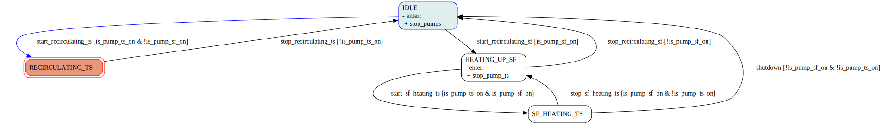
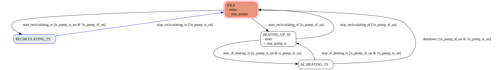
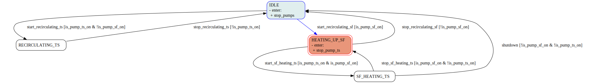
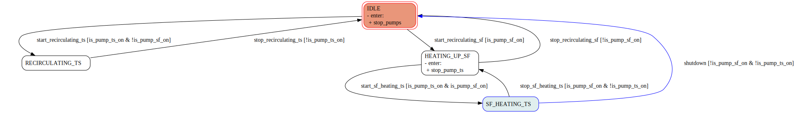
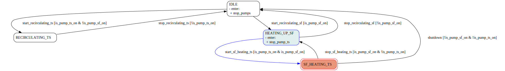
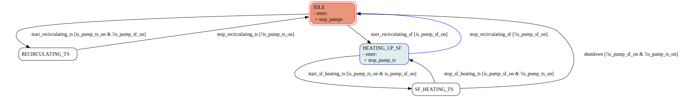

# Solar MED 
test results

---

## State evolution

---

<grid drag="100 40" drop="top" bg="red">
**State evolution**

</grid>

<grid drag="100 40" drop="bottom" bg="blue">
Decision variables

</grid>

---

## Iterations

---

 

<grid drag="70 50" drop="topleft" bg="red">
Facility diagram

</grid>

<grid drop="right" drag="30 100" bg="green">
Finite state machine

</grid>

<grid drag="35 50" drop="bottomleft" bg="coral">
Costs

</grid>

<grid drag="35 50" drop="35 50" bg="blue">
MED relative consumptions

</grid>

---
 

<grid drag="70 50" drop="topleft" bg="red">
Facility diagram

</grid>

<grid drop="right" drag="30 100" bg="green">
Finite state machine

</grid>

<grid drag="35 50" drop="bottomleft" bg="coral">
Costs

</grid>

<grid drag="35 50" drop="35 50" bg="blue">
MED relative consumptions

</grid>

---
 

<grid drag="70 50" drop="topleft" bg="red">
Facility diagram

</grid>

<grid drop="right" drag="30 100" bg="green">
Finite state machine

</grid>

<grid drag="35 50" drop="bottomleft" bg="coral">
Costs

</grid>

<grid drag="35 50" drop="35 50" bg="blue">
MED relative consumptions

</grid>

---
 

<grid drag="70 50" drop="topleft" bg="red">
Facility diagram

</grid>

<grid drop="right" drag="30 100" bg="green">
Finite state machine

</grid>

<grid drag="35 50" drop="bottomleft" bg="coral">
Costs

</grid>

<grid drag="35 50" drop="35 50" bg="blue">
MED relative consumptions

</grid>

---
 

<grid drag="70 50" drop="topleft" bg="red">
Facility diagram

</grid>

<grid drop="right" drag="30 100" bg="green">
Finite state machine

</grid>

<grid drag="35 50" drop="bottomleft" bg="coral">
Costs

</grid>

<grid drag="35 50" drop="35 50" bg="blue">
MED relative consumptions

</grid>

---
 

<grid drag="70 50" drop="topleft" bg="red">
Facility diagram

</grid>

<grid drop="right" drag="30 100" bg="green">
Finite state machine

</grid>

<grid drag="35 50" drop="bottomleft" bg="coral">
Costs

</grid>

<grid drag="35 50" drop="35 50" bg="blue">
MED relative consumptions

</grid>

---
 

<grid drag="70 50" drop="topleft" bg="red">
Facility diagram

</grid>

<grid drop="right" drag="30 100" bg="green">
Finite state machine

</grid>

<grid drag="35 50" drop="bottomleft" bg="coral">
Costs

</grid>

<grid drag="35 50" drop="35 50" bg="blue">
MED relative consumptions

</grid>

---
 

<grid drag="70 50" drop="topleft" bg="red">
Facility diagram

</grid>

<grid drop="right" drag="30 100" bg="green">
Finite state machine

</grid>

<grid drag="35 50" drop="bottomleft" bg="coral">
Costs

</grid>

<grid drag="35 50" drop="35 50" bg="blue">
MED relative consumptions

</grid>

---
 

<grid drag="70 50" drop="topleft" bg="red">
Facility diagram

</grid>

<grid drop="right" drag="30 100" bg="green">
Finite state machine

</grid>

<grid drag="35 50" drop="bottomleft" bg="coral">
Costs

</grid>

<grid drag="35 50" drop="35 50" bg="blue">
MED relative consumptions

</grid>

---

