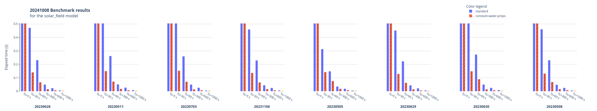
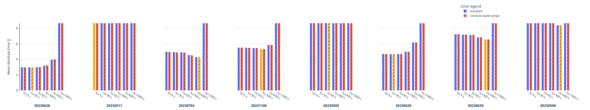

# Benchmark

In order to have a systematic comparison of the performance of the models depending on their configuration, and dataset used. A benchmarking utility has been included in each component model, plus some others. The notebook that showcases its usage is [benchmarks.ipynb](../../notebooks/benchmarks.ipynb).

## Results

TODO: This should probably be automated

### Solar field

#### 20241008

The inclusion of the possibility of providing and then heeping constant the water properties in the solar field greatly improves its evaluation time whilst having little to no impact on the MAE. This is a good example of how the benchmarking utility can be used to test the impact of different configurations on the model's performance.

On the other hand, regarding the sample time, it seems up to 300-600 seconds the model outputs acceptable results, greater values seem to degrade significantly the model's performance or even break it.

### Thermal storage

#### 20241008

Similar conclusion to [[#solar-field-20241008]] but in this case, the model is more robust to increased values of the sample time.

