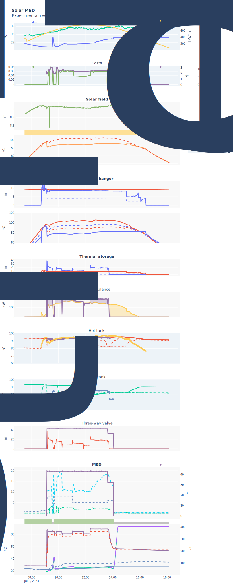
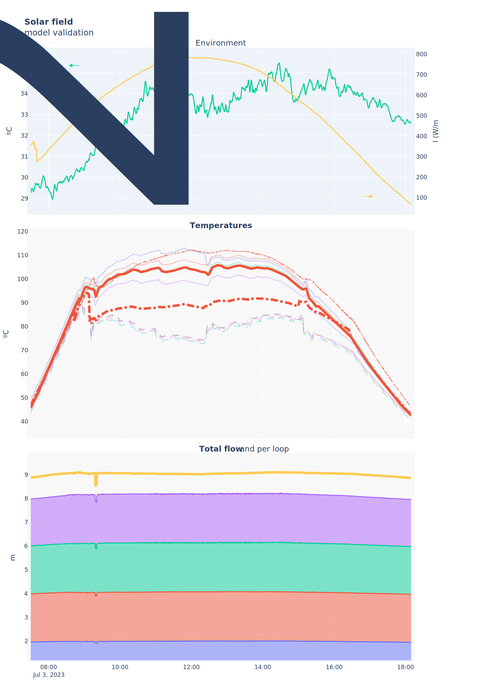

---
Generated at 2024-05-09 15:39
Sample rate: 30s

Model parameters:
`lims_mts_src`: `(0.95, 20)`
`lims_msf`: `(4.7, 14)`
`lims_mmed_s`: `(30, 48)`
`lims_mmed_f`: `(5, 9)`
`lims_mmed_c`: `(8, 21)`
`lims_Tmed_s_in`: `(60, 75)`
`lims_Tsf_out`: `(65, 120.0)`
`lims_T_hot`: `(0, 120.0)`
`use_models`: `True`
`use_finite_state_machine`: `True`
`sample_time`: `30.0`
`resolution_mode`: `simple`
`vacuum_duration_time`: `300`
`brine_emptying_time`: `180`
`startup_duration_time`: `60`
`med_actuators`: `[{'id': 'med_brine_pump', 'coefficients': [0.010371467694486103, -0.025160600483389525, 0.03393870518526908]}, {'id': 'med_feed_pump', 'coefficients': [0.7035299527191431, -0.09466303549610014, 0.019077706335712326]}, {'id': 'med_distillate_pump', 'coefficients': [4.149635559273511, -3.6572156762250954, 0.9484207971761789]}, {'id': 'med_cooling_pump', 'coefficients': [5.2178993694785625, -0.9238542100009888, 0.056680794931454774]}, {'id': 'med_heatsource_pump', 'coefficients': [0.031175213554380448, -0.01857544733009508, 0.0013320144040346285]}]`
`ts_actuators`: `[{'id': 'ts_src_pump', 'coefficients': [0.0, 0.0, 0.0, 0.0, 0.0]}]`
`UAts_h`: `[0.0069818, 0.00584034, 0.03041486]`
`UAts_c`: `[0.01396848, 0.0001, 0.02286885]`
`Vts_h`: `[5.94771006, 4.87661781, 2.19737023]`
`Vts_c`: `[5.33410037, 7.56470594, 0.90547187]`
`sf_actuators`: `[{'id': 'sf_pump', 'coefficients': [0.0, 0.0, 0.0, 0.0, 0.0]}]`
`beta_sf`: `0.0436396`
`H_sf`: `13.676448551722462`
`gamma_sf`: `0.1`
`filter_sf`: `0.1`
`nt_sf`: `1`
`np_sf`: `35`
`ns_sf`: `2`
`Lt_sf`: `23.0`
`Acs_sf`: `7.85e-05`
`Kp_sf`: `-0.1`
`Ki_sf`: `-0.01`
`UA_hx`: `13536.596`
`H_hx`: `0`

---

# Solar MED model validation report for test 20230703

Validation report for Solar MED model, it includes validation graphs for the individual [component models](#Components) as well as the [complete system](#Complete system).

For the different visualizations, a static version if shown here, but an interactive `html` version is also available that can be opened in any browser. The link to it is shown above the static image.

# Test visualization

[Interactive version](attachments/20230703_solarMED_visualization.html)

# Components

## Solar field

More detailed information about the model can be found in the [model documentation](../../models/solar_field.md).

- Parameters

| Parameter | Value |
| --------- | ----- |
| β (m)     |  4.36e-02     |
| H (W/m²)? |  13.68     |

### Temperature prediction

- Performance metrics

| Metric | Value |
| ------ | ----- |
| IAE    |       |
| RMSE   |       |
| ITAE   |       |
| MAE    |       |

[Interactive version](attachments/20230703_solar_field_validation.html)

### Inverse (flow prediction)

- Performance metrics

| Metric | Value |
| ------ | ----- |
| IAE    |       |
| RMSE   |       |
| ITAE   |       |
| MAE    |       |

[Interactive version](attachments/20230703_solar_field_inverse_validation.html)

## Heat exchanger

More detailed information about the model can be found in the [model documentation](../../models/heat_exchanger.md).

- Parameters

| Parameter | Value |
| --------- | ----- |
| UA (W/K)  | 1.35e+04      |
| H (W/m²)? | 0.00     |

- Performance metrics

| Metric | Value |
| ------ | ----- |
| IAE    |       |
| RMSE   |       |
| ITAE   |       |
| MAE    |       |

[Interactive version](attachments/20230703_heat_exchanger_validation.html)

## Thermal storage

More detailed information about the model can be found in the [model documentation](../../models/thermal_storage.md).

- Parameters

| Parameter    | Top        | Medium     | Bottom     |
| ------------ | ---------- | ---------- | ---------- |
| $UA_h$ (W/K) | 6.98e-03 | 5.84e-03 | 3.04e-02 |
| $V_h$ (m³)   | 5.95 | 4.88 | 2.20 |
| $UA_c$ (W/K) | 1.40e-02 | 1.00e-04 | 2.29e-02 |
| $V_c$ (m³)   | 5.33 | 7.56 | 0.91 |

- Performance metrics

| Metric | Value |
| ------ | ----- |
| IAE    |       |
| RMSE   |       |
| ITAE   |       |
| MAE    |       |

[Interactive version](attachments/20230703_thermal_storage_validation.html)

## MED

More detailed information about the model can be found in the [model documentation](../../models/MED.md).

- Parameters

- Performance metrics

| Metric | Value |
| ------ | ----- |
| IAE    |       |
| RMSE   |       |
| ITAE   |       |
| MAE    |       |

[Interactive version](attachments/20230703_MED_validation.html)

# Complete system

More detailed information about the model can be found in the [model documentation](../../models/complete_system.md).

(For some reason the static image generation is broken, but the interactive version is displayed correctly)

[Interactive version](attachments/20230703_solarMED_validation.html)

### State evolution

Result of Finiste State Machines (FSMs) evaluation:

[Interactive version](attachments/20230703_solarMED_FSMs.html)

