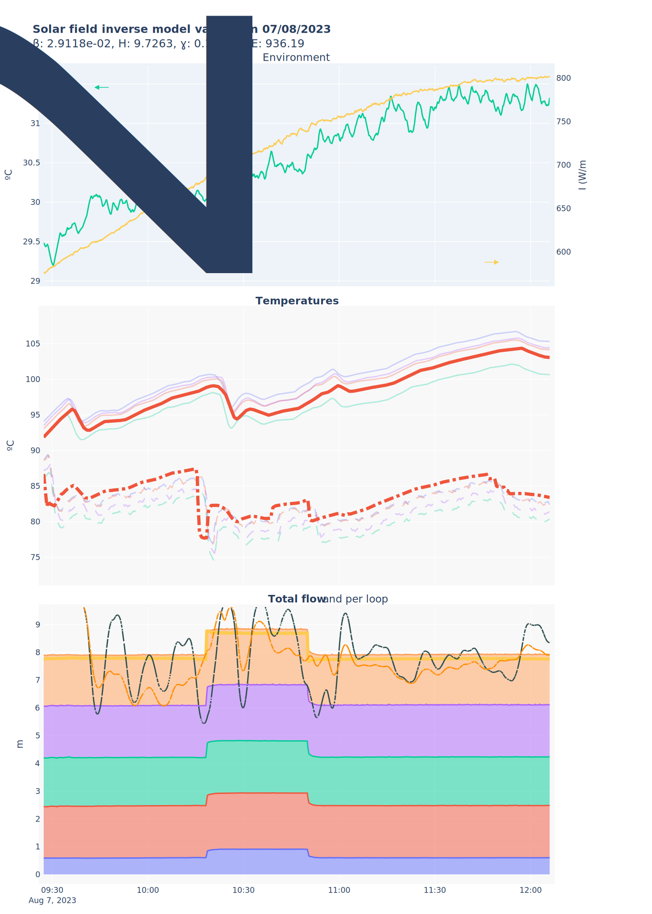

---
Generated at YYYYMMDD HH:MM

---

# Solar MED model validation report for test YYYYMMDD 

Validation report for Solar MED model, it includes validation graphs for the individual [component models](#Components) as well as the [complete system](#Complete system).

For the different visualizations, a static version if shown here, but an interactive `html` version is also available that can be opened in any browser. The link to it is shown above the static image.

# Test visualization

[Interactive version](attachments/YYYYMMDD_solarMED_visualization.html)

# Components

## Solar field

More detailed information about the model can be found in the [model documentation](../../models/solar_field.md).

- Parameters

| Parameter | Value |
| --------- | ----- |
| β (m)     |       |
| H (W/m²)? |       |
| ε (-)     |       |

### Temperature prediction

- Performance metrics

| Metric | Value |
| ------ | ----- |
| IAE    |       |
| RMSE   |       |
| ITAE   |       |
| MAE    |       |

[Interactive version](attachments/YYYYMMDD_solar_field_validation.html)

### Inverse (flow prediction)

- Performance metrics

| Metric | Value |
| ------ | ----- |
| IAE    |       |
| RMSE   |       |
| ITAE   |       |
| MAE    |       |

[Interactive version](attachments/YYYYMMDD_solar_field_inverse_validation.html)

## Heat exchanger

More detailed information about the model can be found in the [model documentation](../../models/heat_exchanger.md).

- Parameters

| Parameter | Value |
| --------- | ----- |
| UA (W/K)  |       |
| H (W/m²)? | 0     |

- Performance metrics

| Metric | Value |
| ------ | ----- |
| IAE    |       |
| RMSE   |       |
| ITAE   |       |
| MAE    |       |

[Interactive version](attachments/YYYYMMDD_heat_exchanger_validation.html)

## Thermal storage

More detailed information about the model can be found in the [model documentation](../../models/thermal_storage.md).

- Parameters

| Parameter    | Top        | Medium     | Bottom     |
| ------------ | ---------- | ---------- | ---------- |
| $UA_h$ (W/K) | 0.0069818  | 0.00584034 | 0.03041486 |
| $V_h$ (m³)   | 5.94771006 | 4.87661781 | 2.19737023 |
| $UA_c$ (W/K) | 0.01396848 | 0.0001     | 0.02286885 |
| $V_c$ (m³)   | 5.33410037 | 7.56470594 | 0.90547187 |
- Performance metrics

| Metric | Value |
| ------ | ----- |
| IAE    |       |
| RMSE   |       |
| ITAE   |       |
| MAE    |       |

[Interactive version](attachments/YYYYMMDD_thermal_storage_validation.html)

## MED

More detailed information about the model can be found in the [model documentation](../../models/MED.md).

- Parameters

- Performance metrics

| Metric | Value |
| ------ | ----- |
| IAE    |       |
| RMSE   |       |
| ITAE   |       |
| MAE    |       |

[Interactive version](attachments/YYYYMMDD_MED_validation.html)

# Complete system

More detailed information about the model can be found in the [model documentation](../../models/complete_system.md).

- Parameters

[Interactive version](attachments/YYYYMMDD_solarMED_validation.html)
